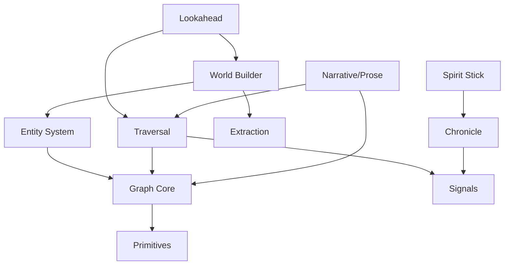
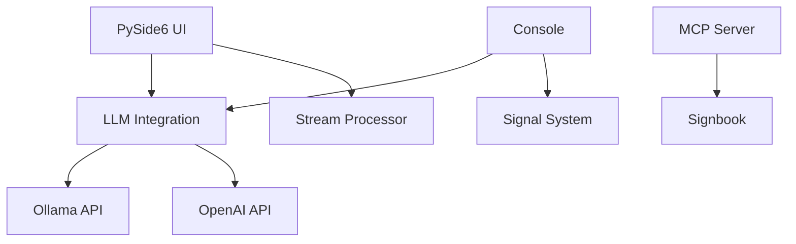

# Infocom Text Game: Game Logic vs API Support Code Separation

This document categorizes all code in the `/islands` directory into **Game Logic** (the infocom text adventure core) versus **API/UI Support Code** (infrastructure, UI, LLM integration).

---

## Summary

| Category | File Count | Purpose |
|----------|------------|---------|
| **Game Logic** | ~25 files | Entity systems, graph traversal, prose composition, world building |
| **API/UI Support** | ~15 files | PySide6 UI, LLM integration, stream processing, MCP servers |
| **Shared Infrastructure** | ~10 files | Context serialization, signal systems, generators |
| **Game Content** | ~5 files | World design documents, character definitions |

---

## GAME LOGIC (Core Infocom System)

These files contain the actual text adventure game mechanics - entities, graphs, prose, and world simulation.

### Primary Game Files

| File | Purpose | Key Classes |
|------|---------|-------------|
| `inage-text/files/my_infocom_entity_system.py` | **Core entity & prose system** | `Entity`, `EntityGraph`, `ProseFragment`, `ProseCompositor`, `ActionProcessor` |
| `inage-text/files/my_infocom_design_document.md` | Design rationale for entity system | (documentation) |
| `inage-text/island_engine_design.md` | Island engine architecture | (documentation) |

### Graph Core (World Structure)

| File | Purpose | Key Classes |
|------|---------|-------------|
| `files(8)/graph_core.py` | **Island graph structure** | `GraphNode`, `Edge`, `IslandGraph`, `NodeType`, `EdgeType` |
| `files(8)/graph_walker.py` | Graph traversal system | `GraphWalker`, `WalkerContext`, `WalkerCallback` |
| `files(8)/narrative.py` | Prose & story management | `ProseFragment`, `StoryBeat`, `StoryManager`, `ProseType` |
| `files(8)/callback_patterns.py` | Event callbacks for game | Callback patterns for graph events |

### Mechanics Directory - Game Systems

| File | Purpose | Key Classes |
|------|---------|-------------|
| `Mechanics/everything/my_infocom_entity_system.py` | Entity system (duplicate) | Same as above |
| `Mechanics/everything/my_infocom_design_document.md` | Design document (duplicate) | (documentation) |
| `Mechanics/everything/world.py` | **WhiteRoom world construction** | `WhiteRoom`, `WorldNode`, `WorldEdge`, `WorldBuilder` |
| `Mechanics/everything/traversal.py` | **Layer-aware traversal** | `TraversalWrapper`, `TraversalContext`, `LayerRegistry` |
| `Mechanics/everything/lookahead.py` | **Possibility analysis** | `LookaheadEngine`, `LookaheadResult`, `Possibility` |
| `Mechanics/everything/extraction.py` | **Text-to-entity extraction** | `TextExtractor`, `ExtractedEntity`, `ExtractedRelation` |
| `Mechanics/everything/primitives.py` | Core enums & protocols | `EntityType`, `SignalType`, `WordClass`, `FragmentCategory` |
| `Mechanics/everything/graph_core.py` | Graph structure | `GraphNode`, `Edge`, `IslandGraph` |
| `Mechanics/everything/graph_walker.py` | Graph traversal | `GraphWalker`, `WalkerContext` |
| `Mechanics/everything/narrative.py` | Story/prose system | `ProseFragment`, `StoryManager` |
| `Mechanics/everything/oracle_tower.py` | Oracle game mechanic | Oracle prediction system |
| `Mechanics/everything/plot_equilibrium.py` | Plot balancing | Plot state management |
| `Mechanics/everything/unified_traversal_lookahead.py` | Complete traversal system | Unified traversal + lookahead |

### Spirit Stick Pattern (Event/Turn System)

| File | Purpose | Key Classes |
|------|---------|-------------|
| `Mechanics/spirit_stick.py` | **Token-passing iterator** | `SpiritStick`, `Participant`, `SpiritCircle`, `TokenPassingIterator` |
| `Mechanics/traversing_spirit_stick.py` | **Branch traversal with predictions** | `Branch`, `BranchFinder`, `Prediction`, `DualOracle`, `Resolver` |
| `Mechanics/hero_quest_chronicle.py` | **Chronicle system with SQLite** | `Chronicle`, `Message`, `HeroActor`, `QuestState` |

### Decoupled Pipelines (Game Architecture)

| File | Purpose | Key Classes |
|------|---------|-------------|
| `Mechanics/iterator2/decoupled_pipelines.py` | **7 decoupled pipelines** | `SignalPipeline`, `ContextPipeline`, `GraphPipeline`, `NarrativePipeline` |
| `Mechanics/iterator2/adapter_patterns.py` | Pipeline adapters | `PipelineAdapter`, `SignalToContextAdapter` |
| `Mechanics/iterator2/advanced_compositions.py` | Composition patterns | `StoryEngineConfig`, `GameWorldConfig` |

---

## API / UI SUPPORT CODE

These files provide infrastructure for UI, LLM integration, and external communication - NOT game logic.

### PySide6 UI Applications

| File | Purpose | Key Features |
|------|---------|--------------|
| `proc_streamer_v1_6.py` | **Main UI application** | Ollama integration, layered text editing, themes, chat dock |
| `proc_streamer_legacy_ui.py` | Legacy UI version | Older UI implementation |
| `story_world_pyside6.py` | **Story world visualizer** | OpenGL rendering, entity tokens, scene graphs, NLP extraction UI |
| `simple_word_processor.py` | Word processor UI | Basic text editing |
| `unified_console_tab.py` | **Console/LLM interface** | Command routing, LLM queries, `/help` commands |
| `aqua.py` | Project Aqua console | Unified console widget |
| `room.html` | HTML room interface | Web-based room display |

### LLM Integration

| File | Purpose | Key Features |
|------|---------|--------------|
| `aqua.py` | LLM routing | Routes between commands and LLM queries |
| `proc_streamer_v1_6.py` | Ollama client | HTTP streaming to Ollama API |
| `unified_console_tab.py` | Multi-provider LLM | Local, OpenAI, Anthropic, HuggingFace support |

### MCP / External API

| File | Purpose | Key Features |
|------|---------|--------------|
| `signbook/last-sign/signbook_mcp.py` | **MCP server** | JSON-RPC 2.0, stdio transport, signbook tools |
| `signbook/last-sign/MCP_SETUP.md` | MCP setup docs | Configuration for Cursor/Claude Desktop |
| `signbook/sonar-sign/SIGNBOOK_DESIGN.md` | API design | REST endpoints, WebSocket, React sketches |

### Stream Processing

| File | Purpose | Key Features |
|------|---------|--------------|
| `Mechanics/stream_processor.py` | **Text transformation** | Encoding detection, mojibake fixing, format detection, sanitization |

---

## SHARED INFRASTRUCTURE

These files provide infrastructure used by BOTH game logic AND API/UI.

### Context & Serialization (matts library)

| File | Purpose | Key Classes |
|------|---------|-------------|
| `matts/__init__.py` | Library entry point | Re-exports all modules |
| `matts/context_system.py` | **Execution contexts** | `SerializableExecutionContext`, `ContextChainNode` |
| `matts/context_serialization.py` | Context serialization | `OptimizedSerializer`, `FastDependencyBundler` |
| `matts/signal_system.py` | **Observer/signal system** | `SignalLine`, `SignalPayload`, `Observer`, `CallbackObserver` |
| `matts/generator_system.py` | Generator composition | `AdvancedGeneratorComposer`, `GeneratorBranch` |
| `matts/graph_system.py` | Relationship graph | `BasicRelationshipGraph`, `GraphNode`, `GraphEdge` |
| `matts/live_code_system.py` | Hot code swapping | `CompleteLiveCodeSystem`, `RuntimeSourceEditor` |
| `matts/functional_interface.py` | Functional API | `create_context`, `emit_signal`, etc. |

### Embedding & Signals (Mechanics)

| File | Purpose | Key Classes |
|------|---------|-------------|
| `Mechanics/everything/embedding.py` | Vector embeddings | `Embedding`, `EmbeddingStore` |
| `Mechanics/everything/signals.py` | Observer pattern | `ObserverBus`, `Observer` |

### Examples

| File | Purpose |
|------|---------|
| `matts/examples/game_narrative_system.py` | Game narrative example using matts |
| `matts/examples/demo_system.py` | Demo of matts library |
| `matts/examples/ai_collaboration_system.py` | AI collaboration patterns |

---

## GAME CONTENT (Design Documents)

These are narrative/world design files, not code.

| File | Purpose |
|------|---------|
| `infocom-transfer/INFOCOM_PROJECT_PROMPT.md` | **Complete game design doc** |
| `infocom-transfer/ARCHON_COMPLETE_CHARACTER.md` | Archon character definition |
| `infocom-transfer/VETRELLIS_COMPLETE_GAZETTEER.md` | World bible - locations, keepers |
| `infocom-transfer/infocom-vetrellis-lighthouse-complete.md` | Lighthouse prose, backstory |
| `infocom-transfer/infocom-archon-lighthouse.md` | Terminal logs as game objects |
| `complete_story_engine_system.md` | Story engine design |
| `claude/` | Claude-specific documentation |

---

## RECOMMENDED FILE ORGANIZATION

To cleanly separate game logic from API support, reorganize into:

```
islands/
├── game/                          # PURE GAME LOGIC
│   ├── core/
│   │   ├── entity_system.py       # From my_infocom_entity_system.py
│   │   ├── graph_core.py          # Island graph structure
│   │   ├── graph_walker.py        # Traversal
│   │   └── primitives.py          # Enums, protocols
│   │
│   ├── world/
│   │   ├── white_room.py          # World construction
│   │   ├── extraction.py          # Text-to-entity
│   │   └── world_builder.py       # WorldBuilder class
│   │
│   ├── narrative/
│   │   ├── prose.py               # ProseFragment, ProseCompositor
│   │   ├── story.py               # StoryBeat, StoryManager
│   │   └── lookahead.py           # Possibility engine
│   │
│   ├── mechanics/
│   │   ├── spirit_stick.py        # Token-passing system
│   │   ├── chronicle.py           # Message storage
│   │   └── traversal.py           # Layer-aware traversal
│   │
│   └── content/
│       ├── vetrellis/             # Vetrellis Isle content
│       │   ├── locations.py
│       │   ├── characters.py
│       │   └── items.py
│       └── archon/                # Archon-specific content
│
├── api/                           # API/EXTERNAL INTERFACES
│   ├── mcp/
│   │   └── signbook_mcp.py        # MCP server
│   ├── rest/                      # Future REST API
│   └── websocket/                 # Future WebSocket
│
├── ui/                            # UI APPLICATIONS
│   ├── pyside6/
│   │   ├── proc_streamer.py       # Main UI
│   │   ├── story_world.py         # Visualizer
│   │   └── console.py             # Console widget
│   └── web/
│       └── room.html              # Web interface
│
├── llm/                           # LLM INTEGRATION
│   ├── ollama.py                  # Ollama client
│   ├── routing.py                 # LLM routing
│   └── providers/                 # OpenAI, Anthropic, etc.
│
├── infra/                         # SHARED INFRASTRUCTURE
│   ├── context/                   # matts context system
│   ├── signals/                   # Observer/signal system
│   ├── serialization/             # Serialization utilities
│   └── stream/                    # Stream processing
│
└── docs/                          # DOCUMENTATION
    ├── design/
    │   ├── INFOCOM_PROJECT.md
    │   └── DESIGN_DOCUMENT.md
    └── content/
        ├── ARCHON.md
        └── VETRELLIS.md
```

---

## KEY DEPENDENCIES

### Game Logic Dependencies



### API Support Dependencies



---

## EXTRACTION PRIORITY

When extracting game logic for use elsewhere:

### Priority 1: Core Game (No UI Dependencies)
1. `inage-text/files/my_infocom_entity_system.py`
2. `files(8)/graph_core.py`
3. `files(8)/graph_walker.py`
4. `Mechanics/everything/primitives.py`

### Priority 2: World Building
1. `Mechanics/everything/world.py`
2. `Mechanics/everything/extraction.py`
3. `Mechanics/everything/traversal.py`
4. `Mechanics/everything/lookahead.py`

### Priority 3: Narrative
1. `files(8)/narrative.py`
2. `Mechanics/spirit_stick.py`
3. `Mechanics/hero_quest_chronicle.py`

### Priority 4: Infrastructure (Shared)
1. `matts/signal_system.py`
2. `matts/context_system.py`
3. `Mechanics/everything/signals.py`

---

## FILES TO EXCLUDE FROM GAME CORE

These should NOT be included in a pure game logic package:

- `proc_streamer_v1_6.py` - UI application
- `story_world_pyside6.py` - UI visualizer
- `unified_console_tab.py` - Console UI
- `aqua.py` - LLM routing UI
- `signbook/` - MCP/signbook system
- `room.html` - Web UI
- `Mechanics/stream_processor.py` - Text utility (optional)
- All `*.pyc`, `__pycache__/`, `env/`

