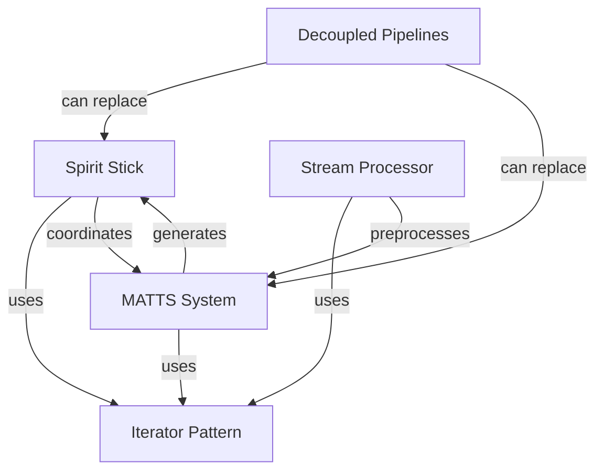

# Mechanics Directory Design Document

## Table of Contents

1. [Introduction](#introduction)
2. [Core Pattern: The Spirit Stick](#core-pattern-the-spirit-stick)
3. [Text Processing System](#text-processing-system)
4. [Decoupled Pipeline Architecture](#decoupled-pipeline-architecture)
5. [MATTS System (Text-to-World)](#matts-system-text-to-world)
6. [Relationships Between Systems](#relationships-between-systems)
7. [Design Patterns Catalog](#design-patterns-catalog)
8. [File Organization](#file-organization)

---

## Introduction

The Mechanics directory contains experimental code exploring iterator-to-event conversion, token-passing systems, text processing, narrative generation, and decoupled pipeline architectures. These systems represent a collection of patterns and implementations for building interactive narrative systems, game mechanics, and text transformation pipelines.

### Key Themes

- **Iterator Patterns**: Converting iteration order into event scheduling
- **Token Passing**: Permission-based access control through token semantics
- **Text Transformation**: Encoding, sanitization, and format handling
- **Narrative Generation**: Converting text into interactive game worlds
- **Decoupled Architecture**: Composable pipelines with minimal coupling

### System Groups

The codebase is organized into four main groups:

1. **Spirit Stick Systems** - Token-passing iterator patterns
2. **Stream Processor** - Text transformation utility
3. **Decoupled Pipelines** - Seven independent, composable pipelines
4. **MATTS System** - Multi-layered Adaptive Text Transformation System

---

## Core Pattern: The Spirit Stick

**Files**: `spirit_stick.py`, `traversing_spirit_stick.py`, `hero_quest_chronicle.py`

### The Pattern

The Spirit Stick pattern is inspired by the movie "Bring It On" (2000), where a physical token grants exclusive permission to speak. This maps to several computer science concepts:

- **Mutex**: Only holder can access shared resource
- **Token Ring**: Token passes around the circle
- **Coroutine**: Yield control to next participant
- **Iterator → Event**: Iteration order determines emission order

### Core Insight

An iterator produces values. But what if those values aren't just data—what if they're **PERMISSION**? The iterator becomes an event scheduler.

**Normal iteration:**
```python
for item in items:
    process(item)  # We act ON the item
```

**Spirit stick iteration:**
```python
for holder in circle:
    holder.speak()  # The item acts (because it has permission)
```

### Three Implementations

#### 1. Basic Spirit Stick (`spirit_stick.py`)

The foundational implementation demonstrating iterator-to-event conversion.

**Key Classes:**

- `SpiritStick` - The token that grants permission
- `Participant` - Abstract participant who can hold the stick
- `SpiritCircle` - The iterator that grants permission sequentially
- `TokenPassingIterator` - Generic token-passing iterator pattern

**Example Usage:**

```python
circle = SpiritCircle([
    SimpleParticipant("Alice", "Hello!"),
    SimpleParticipant("Bob", "Hi there!"),
    SimpleParticipant("Carol", "Greetings!"),
])

circle.add_listener(lambda p, s: print(f"{p.name}: {s}"))

# Iteration becomes event emission
for speaker, speech in circle:
    pass  # Listener handles output
```

**Key Code Reference:**

```66:162:Mechanics/spirit_stick.py
@dataclass
class SpiritStick:
    """
    The token that grants permission to speak.
    
    Physical properties:
        - Exactly one exists per circle
        - Can only be held by one participant at a time
        - Must be explicitly passed (or taken by the iterator)
        - Carries history of who has held it
    
    Metaphysical properties:
        - Grants PERMISSION, not capability
        - The holder COULD stay silent (skip their turn)
        - Dropping the stick is catastrophic (breaks the circle)
    """
    id: str = field(default_factory=lambda: str(uuid.uuid4())[:8])
    
    # Who currently holds the stick (None = in transition)
    holder_id: Optional[str] = None
    
    # History of possession: [(holder_id, acquired_at, released_at), ...]
    history: List[Tuple[str, float, Optional[float]]] = field(default_factory=list)
    
    # Is the stick "live" (in an active circle)?
    active: bool = False
    
    # Has the stick been dropped? (error state)
    dropped: bool = False
    
    def acquire(self, new_holder_id: str) -> bool:
        """
        Transfer the stick to a new holder.
        
        Returns True if successful, False if stick was dropped or
        new_holder already has it.
        """
        if self.dropped:
            return False
        
        if self.holder_id == new_holder_id:
            return True  # Already holding it
        
        # Release from previous holder
        if self.holder_id and self.history:
            # Update the release time of the last entry
            last = self.history[-1]
            self.history[-1] = (last[0], last[1], time.time())
        
        # Transfer to new holder
        self.holder_id = new_holder_id
        self.history.append((new_holder_id, time.time(), None))
        return True
    
    def release(self) -> bool:
        """
        Release the stick (put it down, await next holder).
        """
        if self.dropped or self.holder_id is None:
            return False
        
        if self.history:
            last = self.history[-1]
            self.history[-1] = (last[0], last[1], time.time())
        
        self.holder_id = None
        return True
    
    def drop(self) -> None:
        """
        Drop the stick (error state).
        
        In the movie, dropping the spirit stick brings bad luck.
        In our system, it breaks the iteration contract.
        """
        self.dropped = True
        self.active = False
        self.holder_id = None
    
    def is_held_by(self, participant_id: str) -> bool:
        """Check if a specific participant holds the stick."""
        return self.holder_id == participant_id and not self.dropped
    
    def total_holders(self) -> int:
        """How many unique participants have held the stick."""
        return len(set(h[0] for h in self.history))
    
    def __repr__(self):
        status = "DROPPED" if self.dropped else ("ACTIVE" if self.active else "INACTIVE")
        holder = self.holder_id or "nobody"
        return f"<SpiritStick {self.id} [{status}] held by: {holder}>"
```

#### 2. Traversing Spirit Stick (`traversing_spirit_stick.py`)

Extends the pattern to traverse branches (graphs, linked lists, etc.) with predictions.

**Key Concepts:**

- **Branch**: Generic wrapper that makes any structure traversable
- **BranchFinder**: Creates branches based on conditions
- **Prediction**: What the Resolver expects to happen next
- **Dual Oracle**: Separation of prose generation and fact recording

**Key Classes:**

- `Branch` - Generic traversable wrapper
- `BranchFinder` - Conditional branch discovery
- `Prediction` - Expected story beat
- `ProseOracle` - Generates narrative text
- `ChronicleOracle` - Records facts to chronicle
- `DualOracle` - Coordinates both oracles
- `SpiritStick` - Traverses branches with predictions
- `Resolver` - Coordinates predictions and traversal

**Example Usage:**

```python
nodes = [
    StoryNode("1", "enter", "White Room", "awakening"),
    StoryNode("2", "look", "White Room", "observation"),
    StoryNode("3", "go north", "Corridor", "movement"),
]

dual_oracle = DualOracle()
stick = SpiritStick(dual_oracle)
resolver = Resolver(stick)

resolver.set_story(nodes)

predictions = [
    Prediction(action="enter", outcome="consciousness returns"),
    Prediction(action="look", outcome="walls shimmer"),
    Prediction(action="go", outcome="northward"),
]

resolver.predict_sequence(predictions)

for node, prose, entry in stick.traverse():
    print(f"{prose.text}")
    print(f"Chronicle: {entry.event_type}")
```

**Key Code Reference:**

```90:261:Mechanics/traversing_spirit_stick.py
@dataclass
class Branch(Generic[T]):
    """
    A branch the spirit stick can traverse.
    
    Wraps ANY structure and provides uniform traversal.
    The branch itself IS the iterator (wrapper pattern from TraversalWrapper).
    """
    
    # The underlying structure (list, linked list, graph, etc.)
    source: Any
    
    # Current position in traversal
    _current: Optional[T] = field(default=None, repr=False)
    _index: int = field(default=0, repr=False)
    _visited: List[T] = field(default_factory=list, repr=False)
    _path: List[T] = field(default_factory=list, repr=False)
    
    # Branch metadata
    name: str = "branch"
    condition: Optional[Callable[[T], bool]] = None
    
    # Parent branch (for branching/merging)
    parent: Optional['Branch[T]'] = field(default=None, repr=False)
    
    def __post_init__(self):
        # Detect source type and prepare iterator
        self._prepare_source()
    
    def _prepare_source(self):
        """Prepare the source for iteration based on its type."""
        if isinstance(self.source, list):
            self._iter_mode = 'list'
            self._items = self.source
        elif isinstance(self.source, HasNext):
            self._iter_mode = 'linked'
            self._items = None
        elif isinstance(self.source, HasChildren):
            self._iter_mode = 'tree'
            self._items = None
        elif hasattr(self.source, '__iter__'):
            self._iter_mode = 'iterable'
            self._items = list(self.source)
        else:
            # Single item
            self._iter_mode = 'single'
            self._items = [self.source]
    
    # ─────────────────────────────────────────────────────────────────────────
    # Iterator Protocol: The branch IS the iterator
    # ─────────────────────────────────────────────────────────────────────────
    
    def __iter__(self) -> 'Branch[T]':
        """Reset and return self as iterator."""
        self._index = 0
        self._current = None
        self._visited = []
        self._path = []
        return self
    
    def __next__(self) -> T:
        """
        Advance to next node.
        
        This is where the spirit stick MOVES.
        """
        node = self._get_next_node()
        
        if node is None:
            raise StopIteration
        
        # Update state
        self._current = node
        self._visited.append(node)
        self._path.append(node)
        
        return node
    
    def _get_next_node(self) -> Optional[T]:
        """Get next node based on source type."""
        if self._iter_mode == 'list' or self._iter_mode == 'iterable' or self._iter_mode == 'single':
            if self._index >= len(self._items):
                return None
            node = self._items[self._index]
            self._index += 1
            
            # Apply condition filter if present
            if self.condition and not self.condition(node):
                return self._get_next_node()  # Skip, try next
            
            return node
        
        elif self._iter_mode == 'linked':
            if self._current is None:
                # First iteration
                return self.source
            else:
                return self._current.next
        
        elif self._iter_mode == 'tree':
            # BFS traversal of tree
            if self._current is None:
                return self.source
            # Would need queue for proper BFS
            children = self._current.children
            if children and self._index < len(children):
                child = children[self._index]
                self._index += 1
                return child
            return None
        
        return None
    
    # ─────────────────────────────────────────────────────────────────────────
    # Current State
    # ─────────────────────────────────────────────────────────────────────────
    
    @property
    def current(self) -> Optional[T]:
        """Current node in traversal."""
        return self._current
    
    @property
    def path(self) -> List[T]:
        """Path taken so far."""
        return self._path.copy()
    
    @property
    def visited(self) -> List[T]:
        """All visited nodes."""
        return self._visited.copy()
    
    @property
    def depth(self) -> int:
        """Current depth in traversal."""
        return len(self._path)
    
    # ─────────────────────────────────────────────────────────────────────────
    # Branching: Create sub-branches
    # ─────────────────────────────────────────────────────────────────────────
    
    def branch(self, name: str = None, 
               condition: Callable[[T], bool] = None) -> 'Branch[T]':
        """
        Create a new branch from current position.
        
        The new branch starts where we are now.
        """
        # Remaining items from current position
        if self._iter_mode in ('list', 'iterable', 'single'):
            remaining = self._items[self._index:]
        else:
            remaining = [self._current] if self._current else []
        
        return Branch(
            source=remaining,
            name=name or f"{self.name}.branch",
            condition=condition,
            parent=self
        )
    
    def fork(self, branches: List[Tuple[str, Callable[[T], bool]]]) -> List['Branch[T]']:
        """
        Fork into multiple conditional branches.
        
        Each branch follows items matching its condition.
        """
        return [
            self.branch(name=name, condition=cond)
            for name, cond in branches
        ]
```

#### 3. Chronicle Spirit Stick (`hero_quest_chronicle.py`)

The spirit stick as a chronicle/database. Every message spoken while holding the stick gets carved into SQLite.

**Key Concepts:**

- **Token + Storage Coupling**: The stick grants permission AND remembers what was said
- **Story Time**: Sequential, not wall-clock time
- **Message Types**: Commands, narration, state changes, discoveries, encounters
- **Hero Actor**: Protagonist with command handlers

**Key Classes:**

- `Chronicle` - SQLite-backed message storage with token management
- `Message` - Immutable message record
- `HeroActor` - Protagonist with command handlers
- `QuestState` - Hero's current state (buffer)
- `QuestNarrator` - Adds narrative flavor

**Example Usage:**

```python
chronicle = Chronicle("quest.db")
hero = HeroActor("Aria", chronicle)
narrator = QuestNarrator(chronicle)

chronicle.on_any(create_console_logger())

# Hero acts (acquires stick, processes, chronicles, releases)
hero.act("look")
hero.act("go north")
hero.act("take sword")

# Query the chronicle
recent = chronicle.get_recent(10)
for msg in recent:
    print(f"T{msg.story_time}: {msg.content}")
```

**Key Code Reference:**

```155:482:Mechanics/hero_quest_chronicle.py
class Chronicle:
    """
    The Spirit Stick as a database.
    
    Every message spoken while holding the stick gets carved
    into SQLite. The chronicle IS the history. The stick
    remembers everything.
    
    This is "improper" in the sense that the token (permission
    to speak) is coupled with the storage (record of speech).
    But for a narrative system, this coupling is POETIC:
    
        "You may only speak if you hold the stick,
         and the stick remembers all who spoke."
    """
    
    def __init__(self, db_path: str = ":memory:"):
        """
        Create or connect to the chronicle.
        
        Args:
            db_path: SQLite path. Use ":memory:" for ephemeral,
                     or a file path for persistent chronicle.
        """
        self.db_path = db_path
        self.conn = sqlite3.connect(db_path, check_same_thread=False)
        self.conn.row_factory = sqlite3.Row
        
        # Current story time (monotonically increasing)
        self._story_time: int = 0
        
        # Who currently holds the stick
        self._holder: Optional[str] = None
        
        # Is the chronicle active (accepting messages)?
        self._active: bool = False
        
        # Message queue (incoming, not yet chronicled)
        self._queue: deque[Message] = deque()
        
        # Handlers for different message types
        self._handlers: Dict[MessageType, List[Callable[[Message], Any]]] = {
            mt: [] for mt in MessageType
        }
        
        # Initialize the database
        self._init_db()
    
    def _init_db(self):
        """Create the chronicle tables."""
        self.conn.executescript("""
            -- The main chronicle: all messages in time order
            CREATE TABLE IF NOT EXISTS messages (
                id TEXT PRIMARY KEY,
                msg_type TEXT NOT NULL,
                content TEXT NOT NULL,
                data TEXT,  -- JSON
                source TEXT NOT NULL,
                story_time INTEGER NOT NULL,
                timestamp REAL NOT NULL,
                location TEXT,
                tags TEXT  -- JSON array
            );
            
            -- Index for time-based queries
            CREATE INDEX IF NOT EXISTS idx_story_time 
                ON messages(story_time);
            
            -- Index for source-based queries  
            CREATE INDEX IF NOT EXISTS idx_source 
                ON messages(source);
            
            -- Index for type-based queries
            CREATE INDEX IF NOT EXISTS idx_type 
                ON messages(msg_type);
            
            -- Index for location-based queries
            CREATE INDEX IF NOT EXISTS idx_location 
                ON messages(location);
            
            -- Metadata table (story state, etc)
            CREATE TABLE IF NOT EXISTS meta (
                key TEXT PRIMARY KEY,
                value TEXT
            );
        """)
        self.conn.commit()
        
        # Load story time from meta if exists
        row = self.conn.execute(
            "SELECT value FROM meta WHERE key = 'story_time'"
        ).fetchone()
        if row:
            self._story_time = int(row[0])
    
    # ─────────────────────────────────────────────────────────────────────────
    # Token (stick) management
    # ─────────────────────────────────────────────────────────────────────────
    
    def acquire(self, holder_id: str) -> bool:
        """
        Acquire the spirit stick.
        
        Only the holder can chronicle messages.
        """
        if self._holder is not None and self._holder != holder_id:
            return False  # Someone else has it
        self._holder = holder_id
        self._active = True
        return True
    
    def release(self) -> bool:
        """Release the spirit stick."""
        if self._holder is None:
            return False
        self._holder = None
        return True
    
    def is_held_by(self, holder_id: str) -> bool:
        """Check if specific entity holds the stick."""
        return self._holder == holder_id
    
    @property
    def holder(self) -> Optional[str]:
        return self._holder
    
    # ─────────────────────────────────────────────────────────────────────────
    # Message chronicling (writing to the stick)
    # ─────────────────────────────────────────────────────────────────────────
    
    def chronicle(self, message: Message) -> bool:
        """
        Carve a message into the stick.
        
        The message gets a story_time stamp and is permanently
        recorded in the database.
        """
        if not self._active:
            return False
        
        # Advance story time
        self._story_time += 1
        message.story_time = self._story_time
        
        # Insert into database
        self.conn.execute("""
            INSERT INTO messages 
                (id, msg_type, content, data, source, story_time, 
                 timestamp, location, tags)
            VALUES (?, ?, ?, ?, ?, ?, ?, ?, ?)
        """, (
            message.id,
            message.msg_type.value,
            message.content,
            json.dumps(message.data),
            message.source,
            message.story_time,
            message.timestamp,
            message.location,
            json.dumps(message.tags),
        ))
        
        # Update meta
        self.conn.execute(
            "INSERT OR REPLACE INTO meta (key, value) VALUES ('story_time', ?)",
            (str(self._story_time),)
        )
        self.conn.commit()
        
        # Fire handlers
        for handler in self._handlers.get(message.msg_type, []):
            try:
                handler(message)
            except Exception as e:
                print(f"Handler error: {e}", file=sys.stderr)
        
        return True
    
    def speak(self, content: str, 
              msg_type: MessageType = MessageType.NARRATION,
              source: str = None,
              location: str = None,
              **data) -> Optional[Message]:
        """
        Convenience: create and chronicle a message.
        
        Only works if someone holds the stick.
        """
        if self._holder is None:
            return None
        
        message = Message(
            msg_type=msg_type,
            content=content,
            source=source or self._holder,
            location=location,
            data=data,
        )
        
        if self.chronicle(message):
            return message
        return None
    
    # ─────────────────────────────────────────────────────────────────────────
    # Querying the chronicle (reading the carvings)
    # ─────────────────────────────────────────────────────────────────────────
    
    def _row_to_message(self, row: sqlite3.Row) -> Message:
        """Convert a database row to a Message."""
        return Message(
            id=row['id'],
            msg_type=MessageType(row['msg_type']),
            content=row['content'],
            data=json.loads(row['data']) if row['data'] else {},
            source=row['source'],
            story_time=row['story_time'],
            timestamp=row['timestamp'],
            location=row['location'],
            tags=json.loads(row['tags']) if row['tags'] else [],
        )
    
    def get_all(self, limit: int = None) -> List[Message]:
        """Get all messages in time order."""
        query = "SELECT * FROM messages ORDER BY story_time"
        if limit:
            query += f" LIMIT {limit}"
        rows = self.conn.execute(query).fetchall()
        return [self._row_to_message(r) for r in rows]
    
    def get_recent(self, n: int = 10) -> List[Message]:
        """Get the n most recent messages."""
        rows = self.conn.execute("""
            SELECT * FROM messages 
            ORDER BY story_time DESC 
            LIMIT ?
        """, (n,)).fetchall()
        return [self._row_to_message(r) for r in reversed(rows)]
    
    def get_by_source(self, source: str) -> List[Message]:
        """Get all messages from a specific source."""
        rows = self.conn.execute(
            "SELECT * FROM messages WHERE source = ? ORDER BY story_time",
            (source,)
        ).fetchall()
        return [self._row_to_message(r) for r in rows]
    
    def get_by_type(self, msg_type: MessageType) -> List[Message]:
        """Get all messages of a specific type."""
        rows = self.conn.execute(
            "SELECT * FROM messages WHERE msg_type = ? ORDER BY story_time",
            (msg_type.value,)
        ).fetchall()
        return [self._row_to_message(r) for r in rows]
    
    def get_by_location(self, location: str) -> List[Message]:
        """Get all messages from a specific location."""
        rows = self.conn.execute(
            "SELECT * FROM messages WHERE location = ? ORDER BY story_time",
            (location,)
        ).fetchall()
        return [self._row_to_message(r) for r in rows]
    
    def get_range(self, start_time: int, end_time: int) -> List[Message]:
        """Get messages in a story time range."""
        rows = self.conn.execute("""
            SELECT * FROM messages 
            WHERE story_time >= ? AND story_time <= ?
            ORDER BY story_time
        """, (start_time, end_time)).fetchall()
        return [self._row_to_message(r) for r in rows]
    
    def search(self, term: str) -> List[Message]:
        """Search message content."""
        rows = self.conn.execute("""
            SELECT * FROM messages 
            WHERE content LIKE ?
            ORDER BY story_time
        """, (f"%{term}%",)).fetchall()
        return [self._row_to_message(r) for r in rows]
    
    @property
    def story_time(self) -> int:
        """Current story time."""
        return self._story_time
    
    @property
    def message_count(self) -> int:
        """Total messages in chronicle."""
        row = self.conn.execute("SELECT COUNT(*) FROM messages").fetchone()
        return row[0]
    
    # ─────────────────────────────────────────────────────────────────────────
    # Handler registration
    # ─────────────────────────────────────────────────────────────────────────
    
    def on(self, msg_type: MessageType, 
           handler: Callable[[Message], Any]) -> 'Chronicle':
        """Register a handler for a message type."""
        self._handlers[msg_type].append(handler)
        return self
    
    def on_any(self, handler: Callable[[Message], Any]) -> 'Chronicle':
        """Register a handler for all message types."""
        for mt in MessageType:
            self._handlers[mt].append(handler)
        return self
    
    # ─────────────────────────────────────────────────────────────────────────
    # Buffer: Recent history for context
    # ─────────────────────────────────────────────────────────────────────────
    
    def buffer(self, n: int = 5) -> str:
        """
        Get recent history as formatted text.
        
        This is what the hero "remembers" - recent context
        for making decisions.
        """
        messages = self.get_recent(n)
        lines = []
        for m in messages:
            prefix = f"[{m.msg_type.name}]" if m.msg_type != MessageType.NARRATION else ""
            lines.append(f"{prefix} {m.content}".strip())
        return "\n".join(lines)
    
    def __repr__(self):
        return f"<Chronicle {self.message_count} messages, T={self._story_time}>"
```

### Pattern Summary

The Spirit Stick pattern demonstrates:

1. **Iterator → Event Conversion**: `__next__()` schedules events, `speak()` emits them
2. **Permission Semantics**: Token grants exclusive permission to act
3. **Separation of Concerns**: Prose generation vs. fact recording (Dual Oracle)
4. **Token + Storage Coupling**: Chronicle pattern for narrative systems

---

## Text Processing System

**File**: `stream_processor.py`

### Purpose

A singleton utility for text transformation between streams. Handles encoding detection, format conversion, sanitization, and prettification with special attention to Windows-specific encoding issues.

### Key Capabilities

#### Encoding Detection & Fixing

- **BOM Detection**: Handles UTF-8 BOM (Windows Notepad)
- **Fallback Chain**: UTF-8 → UTF-8-SIG → CP1252 → Latin-1
- **Mojibake Fixing**: Repairs encoding mix-ups (UTF-8 decoded as wrong encoding)
- **Windows-Specific**: Handles CP1252, smart quotes, Euro symbol

#### Format Detection

Auto-detects: JSON, HTML, XML, Markdown, YAML, ANSI, CSV, RTF

#### Sanitization

- HTML tag stripping
- Control character removal
- Unicode normalization
- Web-safe sanitization (XSS prevention)

#### Prettification

Format-aware formatting:
- JSON indentation
- XML/HTML pretty-printing
- Markdown normalization
- Text wrapping

#### Stream Interception

Context managers for intercepting stdin/stdout with transformation.

### Key Classes

**StreamProcessor** - Singleton processor with fluent interface

```398:465:Mechanics/stream_processor.py
class StreamProcessor:
    """
    Singleton stream processor for text transformation.
    
    Handles formatting, encoding/decoding, prettification, and sanitization
    of text streams. Can be used as a context manager to intercept stdout/stdin.
    
    Usage:
        processor = StreamProcessor.instance()
        
        # Direct processing
        result = processor.process("some text")
        
        # Stream interception
        with processor.intercept_stdout():
            print("This will be processed")
        
        # Chained transforms
        result = (processor
            .chain(text)
            .sanitize()
            .prettify()
            .wrap(width=80)
            .result())
        
        # With external libraries
        import ftfy
        import bleach
        config = ProcessorConfig(
            text_fixer=ftfy,
            sanitizer_backend=bleach,
        )
        processor = StreamProcessor.instance(config)
    """
    
    _instance: StreamProcessor | None = None
    _initialized: bool = False
    
    def __new__(cls, config: ProcessorConfig | None = None) -> StreamProcessor:
        if cls._instance is None:
            cls._instance = super().__new__(cls)
        return cls._instance
    
    def __init__(self, config: ProcessorConfig | None = None) -> None:
        if StreamProcessor._initialized:
            if config is not None:
                self._config = config
            return
        
        self._config = config or ProcessorConfig()
        self._original_stdout: TextIO | None = None
        self._original_stdin: TextIO | None = None
        
        # Compile regex patterns once
        self._ansi_pattern = re.compile(r"\x1b\[[0-9;]*[a-zA-Z]")
        self._ansi_osc_pattern = re.compile(r"\x1b\][^\x07]*\x07")  # OSC sequences
        self._control_pattern = re.compile(r"[\x00-\x08\x0b\x0c\x0e-\x1f\x7f]")
        self._whitespace_pattern = re.compile(r"[ \t]+$", re.MULTILINE)
        self._multi_newline_pattern = re.compile(r"\n{3,}")
        self._c1_control_pattern = re.compile(r"[\x80-\x9f]")
        
        StreamProcessor._initialized = True
    
    @classmethod
    def instance(cls, config: ProcessorConfig | None = None) -> StreamProcessor:
        """Get the singleton instance."""
        return cls(config)
    
    @classmethod
    def reset_instance(cls) -> None:
        """Reset the singleton (primarily for testing)."""
        cls._instance = None
        cls._initialized = False
    
    @property
    def config(self) -> ProcessorConfig:
        """Current configuration."""
        return self._config
    
    @config.setter
    def config(self, value: ProcessorConfig) -> None:
        """Update configuration."""
        self._config = value
```

**ProcessorConfig** - Configuration with plugin backends

```270:314:Mechanics/stream_processor.py
@dataclass
class ProcessorConfig:
    """Configuration for the stream processor."""
    
    # Display settings
    line_width: int = 80
    indent_size: int = 4
    strip_trailing_whitespace: bool = True
    normalize_newlines: bool = True
    
    # Encoding settings
    default_encoding: Encoding = Encoding.UTF8
    fallback_encodings: tuple[Encoding, ...] = (
        Encoding.UTF8_SIG,   # Try UTF-8 with BOM first
        Encoding.CP1252,     # Common Windows encoding
        Encoding.LATIN1,     # Fallback that accepts any byte
    )
    encoding_errors: Literal["strict", "ignore", "replace", "backslashreplace"] = "replace"
    detect_bom: bool = True
    strip_bom: bool = True
    
    # Mojibake fixing
    fix_mojibake: bool = True
    mojibake_aggressive: bool = False  # Try harder fixes (may have false positives)
    
    # Sanitization settings
    strip_html_tags: bool = False
    escape_html_entities: bool = False
    remove_control_chars: bool = True
    normalize_unicode: bool = True
    unicode_form: Literal["NFC", "NFD", "NFKC", "NFKD"] = "NFC"
    
    # ANSI settings
    strip_ansi_codes: bool = False
    
    # Prettify settings
    auto_detect_format: bool = True
    json_indent: int = 2
    xml_indent: int = 2
    
    # Plugin backends (set to library instances if available)
    sanitizer_backend: Sanitizer | None = None  # e.g., bleach
    encoding_detector: EncodingDetector | None = None  # e.g., chardet
    text_fixer: TextFixer | None = None  # e.g., ftfy
```

**TransformChain** - Fluent interface for chaining transformations

```1226:1348:Mechanics/stream_processor.py
class TransformChain:
    """
    Fluent interface for chaining text transformations.
    
    Usage:
        result = (StreamProcessor.instance()
            .chain(text)
            .decode()
            .fix_mojibake()
            .sanitize()
            .prettify()
            .wrap(width=80)
            .result())
    """
    
    def __init__(self, processor: StreamProcessor, text: str | bytes) -> None:
        self._processor = processor
        self._text = text if isinstance(text, str) else ""
        self._bytes = text if isinstance(text, bytes) else None
        self._format: TextFormat | None = None
        self._warnings: list[str] = []
        self._detected_encoding: str | None = None
        self._mojibake_fixed: bool = False
    
    def decode(
        self,
        encoding: Encoding | str | None = None,
    ) -> TransformChain:
        """Decode bytes to string."""
        if self._bytes is not None:
            enc_result = self._processor.detect_encoding(self._bytes)
            self._detected_encoding = enc_result.encoding
            self._text = self._processor.decode(self._bytes, encoding or enc_result.encoding)
            self._bytes = None
        return self
    
    def fix_mojibake(self) -> TransformChain:
        """Fix encoding mix-ups."""
        self._text, self._mojibake_fixed = self._processor.fix_mojibake(self._text)
        return self
    
    def sanitize(self, **kwargs: Any) -> TransformChain:
        """Apply sanitization."""
        self._text = self._processor.sanitize(self._text, **kwargs)
        return self
    
    def sanitize_for_web(self) -> TransformChain:
        """Apply web-safe sanitization."""
        self._text = self._processor.sanitize_for_web(self._text)
        return self
    
    def prettify(self, format_hint: TextFormat | None = None) -> TransformChain:
        """Apply prettification."""
        self._text = self._processor.prettify(self._text, format_hint or self._format)
        return self
    
    def wrap(self, width: int | None = None, **kwargs: Any) -> TransformChain:
        """Wrap text."""
        self._text = self._processor.wrap(self._text, width, **kwargs)
        return self
    
    def indent(self, prefix: str | None = None) -> TransformChain:
        """Indent text."""
        self._text = self._processor.indent(self._text, prefix)
        return self
    
    def dedent(self) -> TransformChain:
        """Dedent text."""
        self._text = self._processor.dedent(self._text)
        return self
    
    def strip_html(self) -> TransformChain:
        """Strip HTML tags."""
        self._text = self._processor.strip_html(self._text)
        return self
    
    def strip_ansi(self) -> TransformChain:
        """Strip ANSI codes."""
        self._text = self._processor.strip_ansi(self._text)
        return self
    
    def apply(self, func: Callable[[str], str]) -> TransformChain:
        """Apply a custom transformation."""
        self._text = func(self._text)
        return self
    
    def with_format(self, format_type: TextFormat) -> TransformChain:
        """Set format hint for subsequent operations."""
        self._format = format_type
        return self
    
    def normalize(self, form: Literal["NFC", "NFD", "NFKC", "NFKD"] = "NFC") -> TransformChain:
        """Normalize Unicode."""
        self._text = unicodedata.normalize(form, self._text)
        return self
    
    def replace(self, old: str, new: str) -> TransformChain:
        """Simple string replacement."""
        self._text = self._text.replace(old, new)
        return self
    
    def regex_replace(self, pattern: str, replacement: str, flags: int = 0) -> TransformChain:
        """Regex replacement."""
        self._text = re.sub(pattern, replacement, self._text, flags=flags)
        return self
    
    def result(self) -> TransformResult:
        """Get the final result."""
        return TransformResult(
            text=self._text,
            original_format=self._format or self._processor.detect_format(self._text),
            detected_encoding=self._detected_encoding,
            mojibake_fixed=self._mojibake_fixed,
            warnings=self._warnings,
        )
    
    def text(self) -> str:
        """Get just the text result."""
        return self._text
    
    def __str__(self) -> str:
        return self._text
```

### Windows Encoding Issues

The system specifically addresses common Windows encoding problems:

1. **UTF-8 BOM**: Microsoft Notepad prepends BOM (0xEF 0xBB 0xBF)
2. **CP1252 vs UTF-8**: Windows default encoding differences
3. **Smart Quotes**: Character 0x93, 0x94 in CP1252
4. **Euro Symbol**: 0x80 in CP1252
5. **Mojibake Patterns**: UTF-8 decoded as CP1252/Latin-1

### Integration Points

- Can preprocess text for MATTS extraction
- Can feed spirit stick circle with processed text
- Can sanitize output for web display
- Can handle encoding issues from Windows-generated content

---

## Decoupled Pipeline Architecture

**Files**: `iterator2/decoupled_pipelines.py`, `iterator2/adapter_patterns.py`, `iterator2/advanced_compositions.py`

### Purpose

Seven independent pipelines that can be composed via thin adapters. Each pipeline is self-contained with zero hard dependencies on others.

### Design Principles

1. **Zero Hard Dependencies**: Pipelines don't import each other
2. **Protocol-Based Interfaces**: Composition via protocols
3. **Thin Adapters**: Minimal translation logic
4. **Self-Contained**: Each pipeline is independently testable

### The 7 Pipelines

#### 1. SignalPipeline
Event dispatch and observer management with priority support.

#### 2. ContextPipeline
State management with serialization, snapshots, and branching.

#### 3. GeneratorPipeline
Yield/iteration composition for generator chaining.

#### 4. GraphPipeline
Relationship and traversal operations for graph structures.

#### 5. NarrativePipeline
Story/chain execution for narrative progression.

#### 6. IteratorPipeline
Persistent context windows for iterator-based processing.

#### 7. CodePipeline
Runtime code management for hot-swapping and execution.

### Composition Patterns

The `advanced_compositions.py` file demonstrates six composition patterns:

1. **StoryEngine**: Narrative + Context + Signal
   - Story structure with reactive state and event-driven progression

2. **GameWorld**: Graph + Iterator + Context
   - Graph traversal with persistent state

3. **AICollaboration**: Generator + Signal + Code
   - Code generation with event-driven updates

4. **TextProcessor**: Iterator + Generator + Code
   - Text processing pipeline

5. **EventSourcing**: Signal + Context + Iterator
   - Event-driven state management

6. **WorldBuilder**: Graph + Narrative + Context
   - World construction from narrative chains

### Adapter Patterns

The `adapter_patterns.py` file provides adapters for bridging pipelines:

- Signal ↔ Context
- Generator ↔ Narrative
- Graph ↔ Iterator
- And more...

Each adapter follows the same principles:
- Thin wrapper with minimal logic
- Protocol-based (works with any implementation)
- Bidirectional (can adapt either direction)
- Composable (adapters can chain)

### Integration with Spirit Stick

The decoupled pipelines could replace monolithic systems:

- **Spirit Stick** could use SignalPipeline + ContextPipeline
- **Chronicle** could use ContextPipeline for state
- **Branch Traversal** could use GraphPipeline
- **Narrative Events** could use NarrativePipeline

---

## MATTS System (Text-to-World)

**Files**: `everything/` directory

### Purpose

Multi-layered Adaptive Text Transformation System - converts text into interactive game worlds. The philosophy: "We don't author puzzles - we scan text, analyze every word, and construct a world from what we find."

### Architecture Layers

The system is organized into 6 dependency layers:

```
Layer 5: lookahead.py    - Possibility analysis engine
Layer 4: world.py        - WhiteRoom game world construction
Layer 3: extraction.py   - Text analysis pipeline
Layer 2: traversal.py    - Layers, context, smart iterator
Layer 1: embedding.py    - Vector storage
         signals.py      - Generic Observer[P] pattern
Layer 0: primitives.py   - Enums, protocols, base classes
```

#### Layer 0: Primitives

**File**: `primitives.py`

Foundation layer with no dependencies:
- Enums: `Priority`, `StorageType`, `SignalType`, `WordClass`, `FragmentCategory`, `PossibilityType`
- Protocols: `HasId`, `HasName`, `Serializable`, `Embeddable`
- Base classes: `Identified`, `Context`

#### Layer 1: Embedding & Signals

**Files**: `embedding.py`, `signals.py`

- **Embedding**: Vector storage for semantic operations
- **Signals**: Generic observer pattern with priority support

#### Layer 2: Traversal

**File**: `traversal.py`

**Key Concepts:**

- **Layers**: Same nodes, different edge visibility
- **TraversalWrapper**: The wrapper IS the iterator (`__iter__()` returns self)
- **TraversalContext**: State that travels with traversal
- **Layer Switching**: Can switch layers mid-iteration

**Key Code Reference:**

```138:226:Mechanics/everything/traversal.py
@dataclass
class TraversalContext(Context):
    """
    State that travels with the traversal wrapper.
    
    Compatible with GraphWalker's WalkerContext.
    """
    # Position
    current_node: Any = None
    previous_node: Any = None
    
    # History
    path: List[Any] = field(default_factory=list)
    visited: Set[str] = field(default_factory=set)
    depth: int = 0
    step_count: int = 0
    
    # Layers
    current_layer: str = "default"
    layer_stack: List[str] = field(default_factory=list)
    
    # Game state
    flags: Dict[str, bool] = field(default_factory=dict)
    counters: Dict[str, int] = field(default_factory=dict)
    inventory: List[str] = field(default_factory=list)
    memories: List[Dict] = field(default_factory=list)
    buffer: Dict[str, Any] = field(default_factory=dict)
    events: List[Dict] = field(default_factory=list)
    
    # Graph reference (can be swapped!)
    graph_ref: Any = None
    
    # ─────────────────────────────────────────────────────────────────────────
    # Node ID extraction
    # ─────────────────────────────────────────────────────────────────────────
    
    def node_id(self, node: Any) -> str:
        if hasattr(node, 'id'):
            return node.id
        return str(node)
    
    # ─────────────────────────────────────────────────────────────────────────
    # Layer management
    # ─────────────────────────────────────────────────────────────────────────
    
    def push_layer(self, layer: str):
        self.layer_stack.append(self.current_layer)
        self.current_layer = layer
    
    def pop_layer(self) -> str:
        if self.layer_stack:
            self.current_layer = self.layer_stack.pop()
        return self.current_layer
    
    # ─────────────────────────────────────────────────────────────────────────
    # Visit tracking
    # ─────────────────────────────────────────────────────────────────────────
    
    def mark_visited(self, node: Any):
        self.visited.add(self.node_id(node))
    
    def is_visited(self, node: Any) -> bool:
        return self.node_id(node) in self.visited
```

#### Layer 3: Extraction

**File**: `extraction.py`

**Purpose**: Scan text → analyze every word → construct structured data

**Extracted Data Types:**

- `ExtractedWord` - Classified words from text
- `ExtractedEntity` - Entities (locations, characters, items, concepts)
- `ExtractedRelation` - Relations between entities
- `ExtractedFragment` - Prose fragments with conditions

**Key Code Reference:**

```130:254:Mechanics/everything/extraction.py
class TextExtractor:
    """
    Extracts structured data from source text.
    
    Philosophy: "We don't author puzzles - we scan text, analyze every word,
    and construct a world from what we find."
    """
    
    # Word indicators
    LOCATION_WORDS = frozenset({
        'room', 'house', 'building', 'cave', 'forest', 'castle', 'tower',
        'garden', 'kitchen', 'hall', 'corridor', 'door', 'gate', 'street',
        'path', 'road', 'bridge', 'chamber', 'cellar', 'attic'
    })
    
    CHARACTER_WORDS = frozenset({
        'man', 'woman', 'person', 'wizard', 'witch', 'guard', 'stranger',
        'king', 'queen', 'knight', 'merchant', 'child', 'boy', 'girl'
    })
    
    ITEM_WORDS = frozenset({
        'key', 'sword', 'book', 'letter', 'ring', 'box', 'chest', 'lamp',
        'bottle', 'potion', 'scroll', 'map', 'coin', 'torch', 'dagger'
    })
    
    SPATIAL_PREPS = frozenset({
        'in', 'on', 'under', 'near', 'beside', 'behind', 'above',
        'below', 'inside', 'outside', 'through', 'between', 'at'
    })
    
    ARTICLES = frozenset({'a', 'an', 'the'})
    PRONOUNS = frozenset({'he', 'she', 'it', 'they', 'him', 'her', 'them'})
    
    def __init__(self, bus: ObserverBus = None):
        self._bus = bus
        self._reset()
    
    def _reset(self):
        """Reset extraction state"""
        self._entities: Dict[str, ExtractedEntity] = {}
        self._name_to_id: Dict[str, str] = {}
        self._last_entity_id: Optional[str] = None  # For pronoun resolution
    
    def extract(self, text: str) -> ExtractionResult:
        """
        Main extraction entry point.
        
        Scan text → extract words → find entities → find relations → 
        extract fragments → resolve references → calculate confidence.
        """
        start = time.time()
        self._reset()
        
        if self._bus:
            self._bus.emit_type(SignalType.EXTRACTION_START)
        
        words = []
        relations = []
        fragments = []
        
        # Split into paragraphs
        paragraphs = [p.strip() for p in text.split('\n\n') if p.strip()]
        
        position = 0
        for para_idx, para in enumerate(paragraphs):
            # Split into sentences
            sentences = re.split(r'(?<=[.!?])\s+', para)
            
            for sent_idx, sentence in enumerate(sentences):
                if not sentence.strip():
                    continue
```

#### Layer 4: World

**File**: `world.py`

**Purpose**: Construct WhiteRoom game world from extracted data

**Key Concepts:**

- **WhiteRoom**: The origin - featureless space where world forms
- **WorldNode**: Nodes with prose fragments and embeddings
- **WorldEdge**: Edges with layer information
- **Prose Fragments**: Conditional text attached to nodes

**Key Code Reference:**

```109:200:Mechanics/everything/world.py
class WhiteRoom:
    """
    The game world constructed from extracted text.
    
    The White Room is the origin - a featureless space where the world forms.
    Compatible with IslandGraph but adds embedding support.
    """
    
    def __init__(self, name: str = "White Room"):
        self.name = name
        self.id = str(uuid.uuid4())
        
        # Storage
        self.nodes: Dict[str, WorldNode] = {}
        self.edges: List[WorldEdge] = []
        
        # Embedding storage (optional)
        self.embedding_store: Optional[EmbeddingStore] = None
        
        # Indexes
        self._by_type: Dict[str, Set[str]] = defaultdict(set)
        self._by_tag: Dict[str, Set[str]] = defaultdict(set)
        self._edges_from: Dict[str, List[WorldEdge]] = defaultdict(list)
        self._edges_to: Dict[str, List[WorldEdge]] = defaultdict(list)
        
        # Origin node
        self.origin: Optional[WorldNode] = None
    
    # ─────────────────────────────────────────────────────────────────────────
    # Setup
    # ─────────────────────────────────────────────────────────────────────────
    
    def set_embedding_store(self, store: EmbeddingStore):
        """Enable embedding storage for semantic operations"""
        self.embedding_store = store
    
    # ─────────────────────────────────────────────────────────────────────────
    # Node operations
    # ─────────────────────────────────────────────────────────────────────────
    
    def add_node(self, node: WorldNode, embed: bool = True) -> str:
        """Add node, optionally embed it"""
        self.nodes[node.id] = node
        self._by_type[node.node_type].add(node.id)
        for tag in node.tags:
            self._by_tag[tag].add(node.id)
        
        if embed and self.embedding_store:
            node.embedding = self.embedding_store.embed_and_store(node, node.id)
        
        return node.id
    
    def get_node(self, node_id: str) -> Optional[WorldNode]:
        return self.nodes.get(node_id)
    
    def remove_node(self, node_id: str) -> bool:
        if node_id not in self.nodes:
            return False
        
        node = self.nodes[node_id]
        
        # Remove from indexes
        self._by_type[node.node_type].discard(node_id)
        for tag in node.tags:
            self._by_tag[tag].discard(node_id)
        
        # Remove from embedding store
        if self.embedding_store:
            self.embedding_store.remove_for(node_id)
        
        # Remove connected edges
        self.edges = [e for e in self.edges 
                      if e.source_id != node_id and e.target_id != node_id]
        if node_id in self._edges_from:
            del self._edges_from[node_id]
        if node_id in self._edges_to:
            del self._edges_to[node_id]
        
        del self.nodes[node_id]
        return True
    
    # ─────────────────────────────────────────────────────────────────────────
    # Edge operations
    # ─────────────────────────────────────────────────────────────────────────
    
    def add_edge(self, edge: WorldEdge) -> str:
        """Add edge"""
        self.edges.append(edge)
        self._edges_from[edge.source_id].append(edge)
        self._edges_to[edge.target_id].append(edge)
        
        if edge.bidirectional:
```

#### Layer 5: Lookahead

**File**: `lookahead.py`

**Purpose**: Pre-traverse the graph to discover what COULD happen without moving

**Key Concepts:**

- **Lookahead ≠ Movement**: Explores possibility space without changing state
- **Near-Misses**: One condition away = perfect hint
- **Possibility Types**: Reachable locations, blocked paths, locked doors, hidden items, etc.
- **Semantic Similarity**: Finds related nodes via embeddings

**Key Code Reference:**

```25:196:Mechanics/everything/lookahead.py
@dataclass
class Possibility:
    """
    A single discovered possibility.
    
    Represents something that COULD happen from the current position.
    """
    type: PossibilityType
    entity_id: str
    entity_name: str
    
    # Distance/score
    distance: int = 0
    similarity: float = 0.0  # For semantic matches
    
    # Conditions
    conditions_met: List[str] = field(default_factory=list)
    conditions_unmet: List[str] = field(default_factory=list)
    requirements: List[str] = field(default_factory=list)
    
    # Hint text
    hint: Optional[str] = None
    
    # Path info
    path: List[str] = field(default_factory=list)
    via_edge: Optional[str] = None
    via_layer: Optional[str] = None
    
    def is_blocked(self) -> bool:
        """Is this possibility currently blocked?"""
        return len(self.conditions_unmet) > 0
    
    def is_near_miss(self, threshold: int = 1) -> bool:
        """Is this a near-miss (almost reachable)?"""
        return 0 < len(self.conditions_unmet) <= threshold
    
    def to_dict(self) -> Dict[str, Any]:
        return {
            'type': self.type.name,
            'entity_id': self.entity_id,
            'entity_name': self.entity_name,
            'distance': self.distance,
            'similarity': self.similarity,
            'blocked': self.is_blocked(),
            'hint': self.hint
        }


# ═══════════════════════════════════════════════════════════════════════════════
#                              RESULT
# ═══════════════════════════════════════════════════════════════════════════════

@dataclass
class LookaheadResult:
    """Complete lookahead result from a position"""
    origin_id: str
    origin_name: str
    max_depth: int
    
    # All possibilities
    all: List[Possibility] = field(default_factory=list)
    
    # Indexed views
    by_type: Dict[PossibilityType, List[Possibility]] = field(
        default_factory=lambda: defaultdict(list)
    )
    by_entity: Dict[str, List[Possibility]] = field(
        default_factory=lambda: defaultdict(list)
    )
    
    # Stats
    entities_seen: int = 0
    edges_traversed: int = 0
    blocked_count: int = 0
    near_miss_count: int = 0
    
    def add(self, p: Possibility):
        """Add a possibility"""
        self.all.append(p)
        self.by_type[p.type].append(p)
        self.by_entity[p.entity_id].append(p)
        
        if p.is_blocked():
            self.blocked_count += 1
        if p.is_near_miss():
            self.near_miss_count += 1
    
    # ─────────────────────────────────────────────────────────────────────────
    # Filtered access
    # ─────────────────────────────────────────────────────────────────────────
    
    def reachable(self) -> List[Possibility]:
        """Get reachable (unblocked) possibilities"""
        return [p for p in self.all if not p.is_blocked()]
    
    def blocked(self) -> List[Possibility]:
        """Get blocked possibilities"""
        return [p for p in self.all if p.is_blocked()]
    
    def near_misses(self, threshold: int = 1) -> List[Possibility]:
        """Get near-miss possibilities"""
        return [p for p in self.all if p.is_near_miss(threshold)]
    
    def locations(self) -> List[Possibility]:
        """Get reachable locations"""
        return self.by_type.get(PossibilityType.REACHABLE_LOCATION, [])
    
    def items(self) -> List[Possibility]:
        """Get visible items"""
        visible = self.by_type.get(PossibilityType.VISIBLE_ITEM, [])
        hidden = self.by_type.get(PossibilityType.HIDDEN_ITEM, [])
        return visible + hidden
    
    def similar(self, min_score: float = 0.5) -> List[Possibility]:
        """Get semantically similar nodes"""
        return [p for p in self.by_type.get(PossibilityType.SIMILAR_NODE, [])
                if p.similarity >= min_score]
    
    # ─────────────────────────────────────────────────────────────────────────
    # Hint generation
    # ─────────────────────────────────────────────────────────────────────────
    
    def get_hints(self, max_hints: int = 3) -> List[str]:
        """Generate hints for the player"""
        hints = []
        
        # Near-misses are gold
        for p in self.near_misses():
            if p.hint and len(hints) < max_hints:
                hints.append(p.hint)
        
        # Hidden items at close range
        for p in self.by_type.get(PossibilityType.HIDDEN_ITEM, []):
            if p.distance <= 1 and p.hint and len(hints) < max_hints:
                hints.append(p.hint)
        
        # Semantic similar (related concepts)
        for p in self.similar(0.7):
            if p.hint and len(hints) < max_hints:
                hints.append(p.hint)
        
        return hints[:max_hints]
    
    def to_dict(self) -> Dict[str, Any]:
        return {
            'origin_id': self.origin_id,
            'origin_name': self.origin_name,
            'max_depth': self.max_depth,
            'total': len(self.all),
            'blocked': self.blocked_count,
            'near_misses': self.near_miss_count,
            'possibilities': [p.to_dict() for p in self.all]
        }
    
    def summary(self) -> str:
        lines = [
            f"═══ Lookahead from {self.origin_name} ═══",
            f"Depth: {self.max_depth}, Found: {len(self.all)}",
            f"Blocked: {self.blocked_count}, Near-misses: {self.near_miss_count}",
        ]
        
        for ptype in [PossibilityType.REACHABLE_LOCATION, 
                      PossibilityType.VISIBLE_ITEM,
                      PossibilityType.SIMILAR_NODE]:
            items = self.by_type.get(ptype, [])
            if items:
                names = [p.entity_name for p in items[:3]]
                suffix = "..." if len(items) > 3 else ""
                lines.append(f"  {ptype.name}: {', '.join(names)}{suffix}")
        
        return "\n".join(lines)
```

### Key Revelations

From the MATTS design documents:

1. **The Wrapper IS the Iterator**: `__iter__()` returns self. Context persists. Layer switching works mid-iteration.

2. **Same Nodes, Different Edges**: Layers don't change what exists—they change what's visible. A character exists in SPATIAL (where they are) and CHARACTER (who they know).

3. **Lookahead ≠ Movement**: Lookahead explores possibility space WITHOUT changing state. It finds locked doors, hidden items, near-misses, puzzle chains.

4. **Near-Misses Are Gold**: One condition away from something = achievable = perfect hint. The lookahead finds these automatically.

5. **Prose Is Conditional**: Fragments have conditions. Show this if player has key. Show this on first visit. Hide this until examined. Composition happens at runtime.

6. **Text Is Data**: Every word in the source is a potential entity, relation, or prose fragment. We don't author content—we extract it.

---

## Relationships Between Systems

### Spirit Stick ↔ Stream Processor

**Common Patterns:**
- Both use iterator patterns
- Stream processor could feed spirit stick circle
- Both handle text transformation

**Integration Example:**
```python
processor = StreamProcessor.instance()
circle = SpiritCircle()

# Process text and add as participants
processed_text = processor.process(raw_text)
for line in processor.iter_lines(processed_text):
    circle.add(SimpleParticipant("line", line))

# Iteration becomes event emission
for speaker, speech in circle:
    print(speech)
```

### Spirit Stick ↔ Decoupled Pipelines

**Potential Replacements:**
- Spirit stick could be implemented as SignalPipeline + ContextPipeline
- Chronicle could use ContextPipeline for state
- Branch traversal could use GraphPipeline

**Integration Example:**
```python
# Chronicle using ContextPipeline
from iterator2.decoupled_pipelines import ContextPipeline

class ChronicleWithContext:
    def __init__(self):
        self.context = ContextPipeline()
        self.context.create("chronicle_state")
    
    def chronicle(self, message):
        state = self.context.get("chronicle_state")
        state.update({'messages': state.get('messages', []) + [message]})
```

### MATTS ↔ Other Systems

**Integration Points:**
- MATTS traversal uses similar iterator patterns to spirit stick
- Could integrate with spirit stick for narrative events
- Text extraction could feed stream processor
- Lookahead could inform spirit stick predictions

**Integration Example:**
```python
# MATTS world with spirit stick narrative
from everything.world import WhiteRoom
from traversing_spirit_stick import SpiritStick, DualOracle

world = WhiteRoom()
stick = SpiritStick(DualOracle())

# Traverse world with predictions
for node in world.nodes.values():
    prediction = Prediction(
        action="discover",
        outcome=node.get_description(),
        location=node.name
    )
    stick.push_prediction(prediction)

# Generate narrative
for node, prose, entry in stick.traverse():
    print(prose.text)
```

### System Dependency Graph



---

## Design Patterns Catalog

### 1. Token-Passing Iterator

**Description**: Permission-based iteration where iterator order determines event order.

**Key Components**:
- Token (grants permission)
- Iterator (controls order)
- Participants (hold token and act)

**Use Cases**:
- Turn-based systems
- Round-robin schedulers
- Conversation flows
- Event scheduling

**Files**: `spirit_stick.py`

### 2. Iterator-to-Event Conversion

**Description**: Iteration order becomes event scheduling order.

**Key Insight**: `__next__()` schedules events, `speak()` emits them.

**Mapping**:
- `__iter__()` → `start_session()`
- `__next__()` → `dispatch_next_event()`
- `StopIteration` → `session_complete`
- `yield value` → `emit(event)`
- `for x in iter` → `event_loop.run()`

**Files**: `spirit_stick.py`, `traversing_spirit_stick.py`

### 3. Dual Oracle

**Description**: Separation of prose generation and fact recording.

**Components**:
- **ProseOracle**: Generates narrative text (ephemeral)
- **ChronicleOracle**: Records facts (permanent)

**Rationale**: Prose is the telling, chronicle is the truth.

**Files**: `traversing_spirit_stick.py`

### 4. Branch Finder

**Description**: Conditional path discovery through data structures.

**Key Features**:
- Creates branches based on conditions
- Supports attribute-based filtering
- Sequence discovery (start → end)
- Type-based filtering

**Files**: `traversing_spirit_stick.py`

### 5. Chronicle Pattern

**Description**: Token + Storage coupling for narrative systems.

**Key Insight**: The stick grants permission AND remembers what was said.

**Components**:
- Token management (acquire/release)
- SQLite storage
- Story time (sequential, not wall-clock)
- Message types and handlers

**Files**: `hero_quest_chronicle.py`

### 6. Pipeline Adapter

**Description**: Thin translation layers between decoupled systems.

**Principles**:
- Minimal logic (just translation)
- Protocol-based (works with any implementation)
- Bidirectional (can adapt either direction)
- Composable (adapters can chain)

**Files**: `iterator2/adapter_patterns.py`

### 7. Layer System

**Description**: Same nodes, different edge visibility.

**Key Concept**: Layers don't change what exists—they change what's visible.

**Use Cases**:
- Spatial vs. logical relationships
- Character vs. location traversal
- Temporal vs. spatial navigation

**Files**: `everything/traversal.py`

### 8. Wrapper-as-Iterator

**Description**: The wrapper IS the iterator (`__iter__()` returns self).

**Benefits**:
- Context persists across iterations
- Layer switching works mid-iteration
- Graph hotswapping possible
- Stateful traversal

**Files**: `everything/traversal.py`, `traversing_spirit_stick.py`

### 9. Lookahead Pattern

**Description**: Explore possibility space without changing state.

**Key Insight**: Lookahead ≠ Movement

**Use Cases**:
- Finding locked doors
- Discovering hidden items
- Identifying near-misses (perfect hints)
- Puzzle chain analysis

**Files**: `everything/lookahead.py`

### 10. Text Extraction Pipeline

**Description**: Scan text → analyze every word → construct structured data.

**Philosophy**: "We don't author puzzles - we scan text, analyze every word, and construct a world from what we find."

**Stages**:
1. Tokenize words
2. Classify words
3. Extract entities
4. Find relations
5. Extract prose fragments
6. Resolve references

**Files**: `everything/extraction.py`

---

## File Organization

### Root Level

- **`spirit_stick.py`** (755 lines)
  - Basic token-passing pattern
  - Iterator-to-event conversion
  - Generic token-passing iterator

- **`traversing_spirit_stick.py`** (1090 lines)
  - Branch traversal with predictions
  - Dual Oracle system
  - Branch finder
  - Resolver coordination

- **`hero_quest_chronicle.py`** (1032 lines)
  - Chronicle implementation
  - SQLite-backed storage
  - Hero actor with command handlers
  - Quest narrator

- **`stream_processor.py`** (1515 lines)
  - Text transformation utility
  - Encoding detection and fixing
  - Format detection and prettification
  - Stream interception

### iterator2/

Advanced iterator and pipeline patterns:

- **`decoupled_pipelines.py`**
  - 7 independent pipelines
  - Protocol definitions
  - Core implementations

- **`adapter_patterns.py`**
  - Pipeline adapters
  - Bidirectional translation
  - Composition examples

- **`advanced_compositions.py`**
  - 6 composition patterns
  - StoryEngine, GameWorld, etc.
  - Use case examples

### everything/

Complete MATTS system:

- **`primitives.py`** - Layer 0: Enums, protocols, base classes
- **`embedding.py`** - Layer 1: Vector storage
- **`signals.py`** - Layer 1: Observer pattern
- **`traversal.py`** - Layer 2: Layers, context, iterator
- **`extraction.py`** - Layer 3: Text analysis
- **`world.py`** - Layer 4: WhiteRoom construction
- **`lookahead.py`** - Layer 5: Possibility engine

Plus design documents and archives.

---

## Implementation Notes

### Technology Stack

- **Python 3.12+** - Modern type hints, dataclasses, protocols
- **SQLite** - Persistent storage for chronicle
- **Protocols** - Runtime-checkable interfaces
- **Type Hints** - Full type annotations

### Design Principles

1. **Iterator Protocol Emphasis**: Heavy use of `__iter__()` and `__next__()`
2. **Protocol-Based Design**: Runtime-checkable interfaces for flexibility
3. **Separation of Concerns**: Prose vs. facts, token vs. storage (when appropriate)
4. **Composability**: Systems can be combined via adapters
5. **Windows Compatibility**: Special handling for Windows encoding issues

### Code Style

- Extensive docstrings with ASCII art headers
- Type hints throughout
- Dataclasses for structured data
- Abstract base classes for protocols
- Enum-based constants

---

## Future Integration Points

### Potential Integrations

1. **Spirit Stick + MATTS**
   - Spirit stick coordinates MATTS narrative events
   - MATTS lookahead informs spirit stick predictions
   - Chronicle records MATTS world state changes

2. **Stream Processor + MATTS**
   - Preprocess text before MATTS extraction
   - Handle encoding issues from source text
   - Format MATTS output for display

3. **Decoupled Pipelines Replacement**
   - Replace monolithic systems with composable pipelines
   - Chronicle uses ContextPipeline
   - Spirit stick uses SignalPipeline + ContextPipeline
   - MATTS traversal uses GraphPipeline

4. **Unified Event System**
   - Chronicle pattern records all system events
   - Spirit stick coordinates event emission
   - MATTS signals integrate with spirit stick events

### Extension Opportunities

1. **Network Support**: Chronicle over network, distributed spirit stick
2. **Persistence**: Save/load game state, chronicle replay
3. **Visualization**: Graph visualization, chronicle timeline
4. **AI Integration**: LLM-based prose generation, prediction refinement
5. **Multiplayer**: Multiple heroes, shared chronicle, turn coordination

---

## Conclusion

The Mechanics directory represents a comprehensive exploration of iterator patterns, token-passing systems, text processing, and narrative generation. The systems are designed to be:

- **Modular**: Each system can stand alone
- **Composable**: Systems can be combined via adapters
- **Extensible**: Patterns can be extended for new use cases
- **Well-Documented**: Extensive docstrings and examples

The codebase demonstrates several important patterns:
- Iterator-to-event conversion
- Token-passing semantics
- Separation of concerns (prose vs. facts)
- Decoupled architecture
- Text-to-world transformation

These patterns can be applied to interactive fiction, game development, text processing, and event-driven systems.

